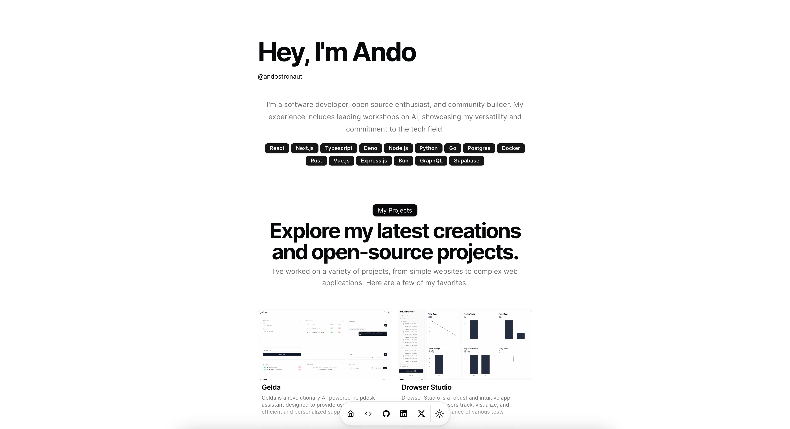

<div align="center">
    
</div>

> This portfolio is using the template provided by [Magic UI](https://magicui.design/)
>
> Big Thanks to [Dillion](https://github.com/dillionverma) for creating this amazing portolio 🚀

[](https://vercel.com/new/clone?repository-url=https%3A%2F%2Fgithub.com%2Fandostronaut%2Fandostronaut.com)

Built with [Next.js](https://nextjs.org/), [Shadcn/ui](https://ui.shadcn.com/), and [Magic UI](https://magicui.design/), deployed on Vercel.

# Getting Started Locally

```bash
git clone https://github.com/andostronaut/andostronaut.com.git
cd andostronaut.com
bun install
bun dev
```

# Configuration

Open the [Config file](./src/data/resume.tsx) and make changes

# License

Licensed under the [MIT license](LICENSE.md).
